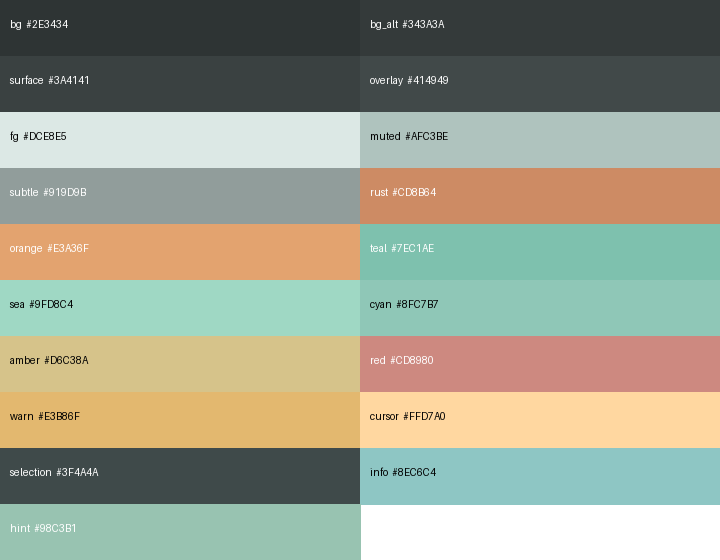

# redox.nvim

Two styles sharing the same gray/green hue family and rust/orange accent palette.

- **`redox`** — dark, built around $\color{#2E3434}{\blacksquare}$ **#2E3434**
- **`redox-light`** — light, built around $\color{#E4EDE9}{\blacksquare}$ **#E4EDE9**

## Installation

### lazy.nvim

```lua
{
  "joakimmj/redox.nvim",
  priority = 1000,  -- load before other plugins
  opts = {},        -- use defaults, or pass options (see Configuration)
  init = function()
    vim.cmd.colorscheme("redox")        -- dark
    -- vim.cmd.colorscheme("redox-light")  -- light
  end,
}
```

### vim-plug

```vim
Plug 'joakimmj/redox.nvim'
```

```lua
-- After plug#end(), in your Lua config:
require("redox").setup()
vim.cmd.colorscheme("redox")
```

## Configuration

`setup()` accepts an optional table. All fields are optional and shown with
their defaults:

```lua
require("redox").setup({
  style = "redox",          -- "redox" (dark) or "redox-light"
  transparent = false,      -- transparent background
  terminal_colors = false,  -- apply palette to :terminal
})
```

You can also call `:colorscheme redox` or `:colorscheme redox-light` directly
without calling `setup()` — it will use the defaults above.

To toggle transparency at runtime:

```lua
require("redox").toggle_transparency()
```

### Extending highlights

`get_colors()` returns the active palette so you can reference the exact color
tokens when overriding highlight groups in your own config:

```lua
require("redox").setup({ style = "redox-light" })

local c = require("redox").get_colors()

vim.api.nvim_set_hl(0, "WinBar",     { fg = c.muted, bg = c.surface })
vim.api.nvim_set_hl(0, "WinBarNC",   { fg = c.subtle, bg = c.surface })
vim.api.nvim_set_hl(0, "NeoTreeNormal", { fg = c.fg, bg = c.bg_alt })
```

Call `get_colors()` **after** `setup()` (or after loading the colorscheme via
`:colorscheme`) so that the correct style is active.

---

## Extras

Ready-made theme files for various tools live in [`extras/`](./extras/).
See [`extras/README.md`](./extras/README.md) for the full list and installation instructions.

---

## `redox` (dark)



### Neutrals (gray–green)

| Preview | Token | Hex | Intended use | Contrast vs bg (#2E3434) | AA (Normal) | AA (Large) |
|---:|:---|:---:|:---|:---:|:---:|:---:|
| $\color{#2E3434}{\blacksquare}$ | `bg` | `#2E3434` | Editor background | 1.00:1 | Fail | Fail |
| $\color{#343A3A}{\blacksquare}$ | `bg_alt` | `#343A3A` | Alt surfaces (floats/panes) | 1.09:1 | Fail | Fail |
| $\color{#3A4141}{\blacksquare}$ | `surface` | `#3A4141` | Statuslines/menus | 1.21:1 | Fail | Fail |
| $\color{#414949}{\blacksquare}$ | `overlay` | `#414949` | Borders/disabled | 1.37:1 | Fail | Fail |
| $\color{#DCE8E5}{\blacksquare}$ | `fg` | `#DCE8E5` | Primary text | 10.09:1 | Pass | Pass |
| $\color{#AFC3BE}{\blacksquare}$ | `muted` | `#AFC3BE` | Secondary text | 6.86:1 | Pass | Pass |
| $\color{#919D9B}{\blacksquare}$ | `subtle` | `#919D9B` | Comments/line numbers | 4.53:1 | Pass | Pass |

### Accents (pastel)

| Preview | Token | Hex | Suggested usage | Contrast vs bg (#2E3434) | AA (Normal) | AA (Large) |
|---:|:---|:---:|:---|:---:|:---:|:---:|
| $\color{#CD8B64}{\blacksquare}$ | `rust` | `#CD8B64` | Primary accent | 4.51:1 | Pass | Pass |
| $\color{#E3A36F}{\blacksquare}$ | `orange` | `#E3A36F` | Keywords/active tab | 5.88:1 | Pass | Pass |
| $\color{#7EC1AE}{\blacksquare}$ | `teal` | `#7EC1AE` | Functions | 6.11:1 | Pass | Pass |
| $\color{#9FD8C4}{\blacksquare}$ | `sea` | `#9FD8C4` | Strings | 7.90:1 | Pass | Pass |
| $\color{#8FC7B7}{\blacksquare}$ | `cyan` | `#8FC7B7` | Info | 6.65:1 | Pass | Pass |
| $\color{#D6C38A}{\blacksquare}$ | `amber` | `#D6C38A` | Types/numbers | 7.26:1 | Pass | Pass |
| $\color{#CD8980}{\blacksquare}$ | `red` | `#CD8980` | Errors | 4.52:1 | Pass | Pass |
| $\color{#E3B86F}{\blacksquare}$ | `warn` | `#E3B86F` | Warnings | 6.85:1 | Pass | Pass |
| $\color{#FFD7A0}{\blacksquare}$ | `cursor` | `#FFD7A0` | Cursor/selection foreground | 9.34:1 | Pass | Pass |
| $\color{#3F4A4A}{\blacksquare}$ | `selection` | `#3F4A4A` | Visual selection background | 1.38:1 | Fail | Fail |
| $\color{#8EC6C4}{\blacksquare}$ | `info` | `#8EC6C4` | Diagnostic info | 6.65:1 | Pass | Pass |
| $\color{#98C3B1}{\blacksquare}$ | `hint` | `#98C3B1` | Diagnostic hint | 6.50:1 | Pass | Pass |

### Terminal ANSI 16-color mapping

| Index | Name | Preview | Hex | ANSI FG Code | ANSI BG Code |
|:--:|:--|---:|:---:|:---:|:---:|
| `0`  | `black`        | $\color{#2E3434}{\blacksquare}$ | `#2E3434` | `\x1b[30m` | `\x1b[40m` |
| `8`  | `brightBlack`  | $\color{#4A5353}{\blacksquare}$ | `#4A5353` | `\x1b[90m` | `\x1b[100m` |
| `1`  | `red`          | $\color{#CD8980}{\blacksquare}$ | `#CD8980` | `\x1b[31m` | `\x1b[41m` |
| `9`  | `brightRed`    | $\color{#E08A7F}{\blacksquare}$ | `#E08A7F` | `\x1b[91m` | `\x1b[101m` |
| `2`  | `green`        | $\color{#7FB8A4}{\blacksquare}$ | `#7FB8A4` | `\x1b[32m` | `\x1b[42m` |
| `10` | `brightGreen`  | $\color{#A9D6C6}{\blacksquare}$ | `#A9D6C6` | `\x1b[92m` | `\x1b[102m` |
| `3`  | `yellow`       | $\color{#D6C38A}{\blacksquare}$ | `#D6C38A` | `\x1b[33m` | `\x1b[43m` |
| `11` | `brightYellow` | $\color{#EBD9A8}{\blacksquare}$ | `#EBD9A8` | `\x1b[93m` | `\x1b[103m` |
| `4`  | `blue`         | $\color{#6FAFBD}{\blacksquare}$ | `#6FAFBD` | `\x1b[34m` | `\x1b[44m` |
| `12` | `brightBlue`   | $\color{#92CAD4}{\blacksquare}$ | `#92CAD4` | `\x1b[94m` | `\x1b[104m` |
| `5`  | `magenta`      | $\color{#B28FA3}{\blacksquare}$ | `#B28FA3` | `\x1b[35m` | `\x1b[45m` |
| `13` | `brightMagenta`| $\color{#D3ABC0}{\blacksquare}$ | `#D3ABC0` | `\x1b[95m` | `\x1b[105m` |
| `6`  | `cyan`         | $\color{#8FC7B7}{\blacksquare}$ | `#8FC7B7` | `\x1b[36m` | `\x1b[46m` |
| `14` | `brightCyan`   | $\color{#B6E3D5}{\blacksquare}$ | `#B6E3D5` | `\x1b[96m` | `\x1b[106m` |
| `7`  | `white`        | $\color{#DCE8E5}{\blacksquare}$ | `#DCE8E5` | `\x1b[37m` | `\x1b[47m` |
| `15` | `brightWhite`  | $\color{#F1F6F4}{\blacksquare}$ | `#F1F6F4` | `\x1b[97m` | `\x1b[107m` |

### Notes

- Keep accents low-saturation to retain the calm, pastel look; the table shows
  WCAG contrast ratios against the background `#2E3434` for guidance.
- For long-form text, prefer `fg` over `muted`; use `subtle` for non-critical
  UI like gutters.
- When using `selection` as a background, ensure foreground text uses `fg` for
  readability.

## `redox-light`

Light counterpart — same gray/green hue family and accent names, adjusted for a
light base of $\color{#E4EDE9}{\blacksquare}$ **#E4EDE9**.

### Neutrals (gray–green)

| Preview | Token | Hex | Intended use | Contrast vs bg (#E4EDE9) | AA (Normal) | AA (Large) |
|---:|:---|:---:|:---|:---:|:---:|:---:|
| $\color{#E4EDE9}{\blacksquare}$ | `bg` | `#E4EDE9` | Editor background | 1.00:1 | Fail | Fail |
| $\color{#D8E4DF}{\blacksquare}$ | `bg_alt` | `#D8E4DF` | Alt surfaces (floats/panes) | 1.09:1 | Fail | Fail |
| $\color{#CAD7D1}{\blacksquare}$ | `surface` | `#CAD7D1` | Statuslines/menus | 1.24:1 | Fail | Fail |
| $\color{#B4C5BF}{\blacksquare}$ | `overlay` | `#B4C5BF` | Borders/disabled | 1.51:1 | Fail | Fail |
| $\color{#1C2B29}{\blacksquare}$ | `fg` | `#1C2B29` | Primary text | 12.33:1 | Pass | Pass |
| $\color{#3A5450}{\blacksquare}$ | `muted` | `#3A5450` | Secondary text | 6.86:1 | Pass | Pass |
| $\color{#526C68}{\blacksquare}$ | `subtle` | `#526C68` | Comments/line numbers | 4.75:1 | Pass | Pass |

### Accents (muted)

| Preview | Token | Hex | Suggested usage | Contrast vs bg (#E4EDE9) | AA (Normal) | AA (Large) |
|---:|:---|:---:|:---|:---:|:---:|:---:|
| $\color{#8B4820}{\blacksquare}$ | `rust` | `#8B4820` | Primary accent | 5.78:1 | Pass | Pass |
| $\color{#8A4F18}{\blacksquare}$ | `orange` | `#8A4F18` | Keywords/active tab | 5.48:1 | Pass | Pass |
| $\color{#247068}{\blacksquare}$ | `teal` | `#247068` | Functions | 4.90:1 | Pass | Pass |
| $\color{#226858}{\blacksquare}$ | `sea` | `#226858` | Strings | 5.52:1 | Pass | Pass |
| $\color{#267068}{\blacksquare}$ | `cyan` | `#267068` | Info | 4.89:1 | Pass | Pass |
| $\color{#7A5E18}{\blacksquare}$ | `amber` | `#7A5E18` | Types/numbers | 5.11:1 | Pass | Pass |
| $\color{#8B3530}{\blacksquare}$ | `red` | `#8B3530` | Errors | 6.64:1 | Pass | Pass |
| $\color{#7A5618}{\blacksquare}$ | `warn` | `#7A5618` | Warnings | 5.55:1 | Pass | Pass |
| $\color{#3D2A00}{\blacksquare}$ | `cursor` | `#3D2A00` | Cursor/selection foreground | 11.50:1 | Pass | Pass |
| $\color{#B2C4BF}{\blacksquare}$ | `selection` | `#B2C4BF` | Visual selection background | 1.52:1 | Fail | Fail |
| $\color{#246A68}{\blacksquare}$ | `info` | `#246A68` | Diagnostic info | 5.27:1 | Pass | Pass |
| $\color{#2E6A58}{\blacksquare}$ | `hint` | `#2E6A58` | Diagnostic hint | 5.30:1 | Pass | Pass |

### Terminal ANSI 16-color mapping

| Index | Name | Preview | Hex | ANSI FG Code | ANSI BG Code |
|:--:|:--|---:|:---:|:---:|:---:|
| `0`  | `black`         | $\color{#1C2B29}{\blacksquare}$ | `#1C2B29` | `\x1b[30m` | `\x1b[40m` |
| `8`  | `brightBlack`   | $\color{#3A5450}{\blacksquare}$ | `#3A5450` | `\x1b[90m` | `\x1b[100m` |
| `1`  | `red`           | $\color{#7A2828}{\blacksquare}$ | `#7A2828` | `\x1b[31m` | `\x1b[41m` |
| `9`  | `brightRed`     | $\color{#923030}{\blacksquare}$ | `#923030` | `\x1b[91m` | `\x1b[101m` |
| `2`  | `green`         | $\color{#1E6B58}{\blacksquare}$ | `#1E6B58` | `\x1b[32m` | `\x1b[42m` |
| `10` | `brightGreen`   | $\color{#258C72}{\blacksquare}$ | `#258C72` | `\x1b[92m` | `\x1b[102m` |
| `3`  | `yellow`        | $\color{#7A5618}{\blacksquare}$ | `#7A5618` | `\x1b[33m` | `\x1b[43m` |
| `11` | `brightYellow`  | $\color{#926A1E}{\blacksquare}$ | `#926A1E` | `\x1b[93m` | `\x1b[103m` |
| `4`  | `blue`          | $\color{#2A5A88}{\blacksquare}$ | `#2A5A88` | `\x1b[34m` | `\x1b[44m` |
| `12` | `brightBlue`    | $\color{#3A6A9A}{\blacksquare}$ | `#3A6A9A` | `\x1b[94m` | `\x1b[104m` |
| `5`  | `magenta`       | $\color{#6A3A6A}{\blacksquare}$ | `#6A3A6A` | `\x1b[35m` | `\x1b[45m` |
| `13` | `brightMagenta` | $\color{#7A4A7A}{\blacksquare}$ | `#7A4A7A` | `\x1b[95m` | `\x1b[105m` |
| `6`  | `cyan`          | $\color{#1E6A62}{\blacksquare}$ | `#1E6A62` | `\x1b[36m` | `\x1b[46m` |
| `14` | `brightCyan`    | $\color{#267A72}{\blacksquare}$ | `#267A72` | `\x1b[96m` | `\x1b[106m` |
| `7`  | `white`         | $\color{#E4EDE9}{\blacksquare}$ | `#E4EDE9` | `\x1b[37m` | `\x1b[47m` |
| `15` | `brightWhite`   | $\color{#FFFFFF}{\blacksquare}$ | `#FFFFFF` | `\x1b[97m` | `\x1b[107m` |

### Notes

- Accents are darkened relative to the dark theme to maintain contrast against
  the light background; the hue and semantic intent of each token is preserved.
- For long-form text, prefer `fg` over `muted`; use `subtle` for non-critical
  UI like gutters.
- When using `selection` as a background, ensure foreground text uses `fg` for
  readability.

